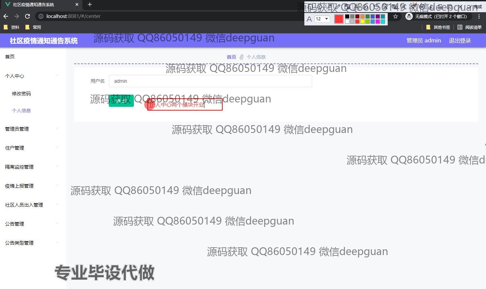

<h1 align="center">基于BS的社区疫情通知通告系统的设计与实现+vue</h1>

## 简介
社区疫情通知通告系统：角色分为管理员、用户；功能包括用户管理、隔离监控管理、疫情上报管理、公告管理、社区人员出入管理，支持数据查询和批量操作，简洁易用，适用于社区疫情防控信息管理。    --计算机毕业设计源码；毕设源码；java毕业设计源码

## 联系方式

<h3 align="center">获取完整代码与数据库文件 + 微信：deepguan QQ: 86050149 QQ群: 783742310</h3>

<h3 align="center">可帮忙远程部署 包运行成功！提供远程部署、修改代码、设计文档指导、代码讲解等服务！</h3>

## 功能介绍（完整见运行截图）
管理员： 管理员可以登录系统并访问各类管理模块，包括用户管理、住户管理、隔离监控和疫情上报管理等。管理员具备增加、修改或删除用户信息的权限，能够上传住户照片及其他相关文件，并管理公告类型。系统提供查询和筛选功能，确保管理员可以根据特定条件高效管理数据。管理员还可以在页面中进行数据筛选和分页浏览，查看住户疫苗接种和核酸检测的情况，确保在疫情防控中快速响应和处理信息。

用户： 用户通过注册和登录进入系统后，可以访问个人信息管理页面，修改用户名和查看个人相关的疫情信息。用户能够录入或更新自己的基本信息，包括姓名、手机号、身份证号、现住地址、疫苗接种状态等。同时，系统提供了方便的照片上传功能和文本编辑器以填备注，让用户能够个性化管理自己的信息。用户可在主界面进行疫情上报，输入详细信息后提交至管理端，系统确保用户仅能查看与自己相关的数据，保障个人隐私。

## 运行截图

本代码来源于网络,仅供学习参考使用!

